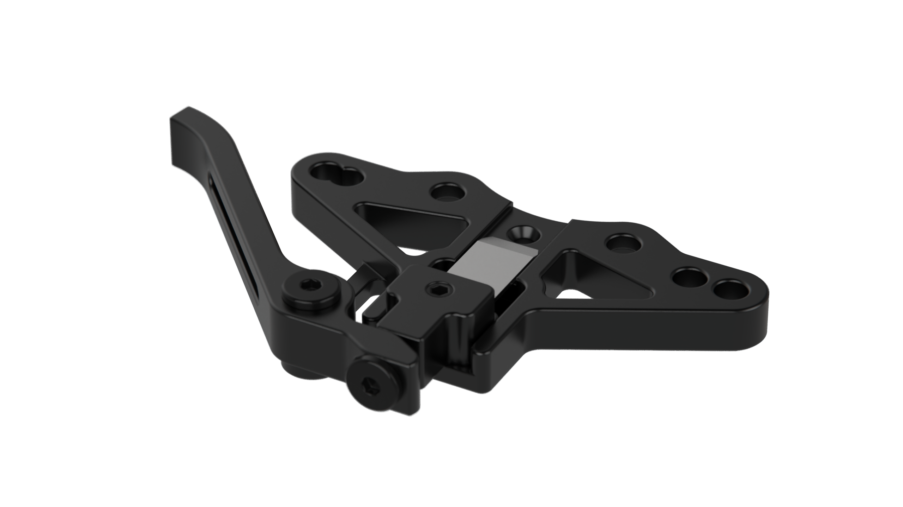
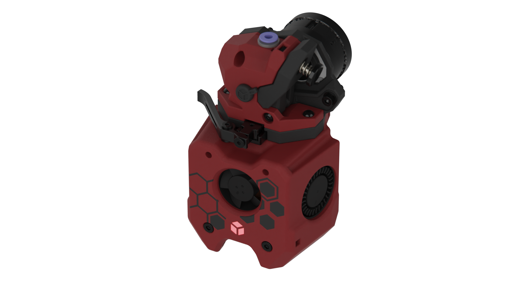
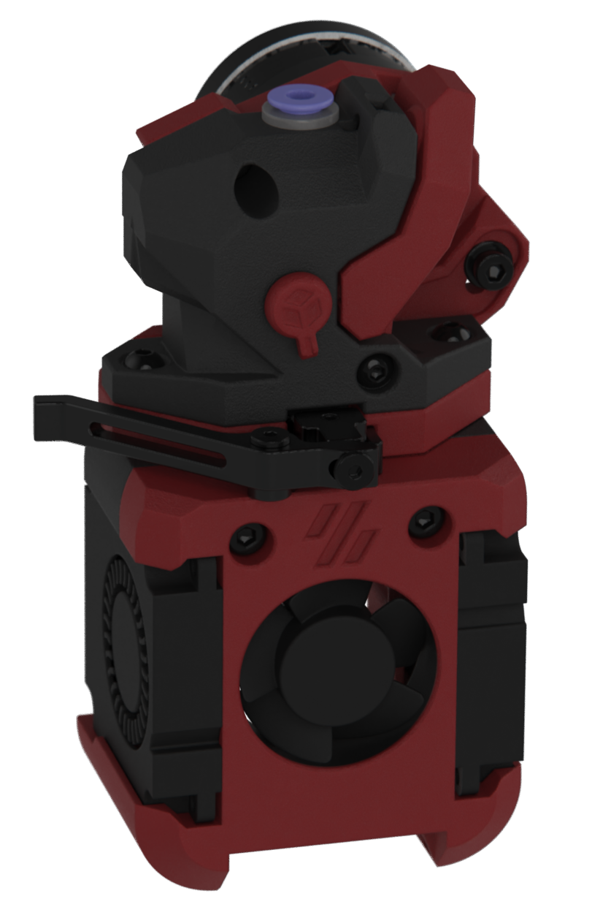

[![CC BY-NC-SA 4.0][cc-by-nc-sa-shield]][cc-by-nc-sa]

# Crossbow
### A CNC filament cutter from DW-Tas: <a href="https://ko-fi.com/O5O5OCC0K"> Ko-Fi</a>, <a href="https://github.com/DW-Tas">GitHub</a>

 

## Design philosophy
The crossbow filament cutter was developed to provide a robust, reliable, easily serviceable, versatile and universal filament cutting solution for printed toolheads. Key features include:
1. Aluminum CNC construction: Reliable cutting action that can withstand multi-thousand operations without wear.
2. Low profile and low mass: maintains toolhead rigidity, centre of mass and input shaper performance.
3. Ease of servicing: two easily accessible screws to remove and replace cutting blade and clean the filament path.

## Designed for the A4T, but intended for universal use
Crossbow was designed and developed around the A4T, but is intended for universal for use in printed toolheads that have a flat mounting surface below the extruder.  
Crossbow A4T parts can be downloaded here: <a href="https://github.com/Armchair-Heavy-Industries/A4T/tree/main/STL/Extruder%20Adapters/For%20Crossbow%20filament%20cutter">https://github.com/Armchair-Heavy-Industries/A4T</a>.
  

> [!TIP] 
> The design accomodates extruders that use the Sherpa-Mini or Oribiter v2.0 mounting hole spacing (Checked for fit with Dragon Burner in CAD models with an example Dragon Burner Mod included in the [Dragon Burner example](<Dragon Burner example>) folder).  

## Blade replacement
Blade replacement is generally recomended after 3000-4000 cuts, depending on the material being cut. Crossbow can use a #17A or #4 hobby knife blade. Trimming the blades to size is required. The following jig is available to help cut the blade down.

**Jig BOM:**
1. 4x M3x8 SHCS / BHCS screws
2. 4x M3 Square Nuts (DIN 562)
3. #17 or #4 hobby knife blade
4. Printed jig parts: [Blade cutting and alignment jig.stl](<STL/Blade cutting and alignment jig.stl>)

**Instructions video:** 

 

## Licenced manufacturers
Crossbow is being manufactured under license by:  
<a href="https://aliexpress.com/store/3480083"> Fysetc AliExpress Store</a>
 
Buy it now: 
* <a href="https://www.fysetc.com/products/fysetc-cnc-crossbow-filament-cutter-used-for-printed-toolheads-compatible-with-a4t-sherpa-mini-oribiter-v2-0-dragon-burner">Fysetc Website</a>
* <a href="https://aliexpress.com/item/1005009769281594.html">AliExpress</a>
  
> [!TIP] 
> ### You can help support the development of this project. 
> Donate at https://ko-fi.com/dwtas 

  

### Credits
* Inspired by Treintjes' <a href="https://github.com/Treintjes/Magneto_Filament_Cutter">Magneto_Filament_Cutter</a>  
* Beta testers
  * igiannakas <a href="https://github.com/igiannakas/">GitHub</a>
  * KnightRadiant <a href="https://github.com/jrlomas/">GitHub</a>
  * jeremytodd1
  * jbob
  
#### This work is licensed under a
[Creative Commons Attribution-NonCommercial-ShareAlike 4.0 International License][cc-by-nc-sa].

[![CC BY-NC-SA 4.0][cc-by-nc-sa-image]][cc-by-nc-sa]

[cc-by-nc-sa]: http://creativecommons.org/licenses/by-nc-sa/4.0/
[cc-by-nc-sa-image]: https://licensebuttons.net/l/by-nc-sa/4.0/88x31.png
[cc-by-nc-sa-shield]: https://img.shields.io/badge/License-CC%20BY--NC--SA%204.0-lightgrey.svg

### License clarification regarding non-commercial use:
The non-commercial aspect of this license is for cases where Crossbow is the product, not the use of Crossbow to create products. 
I.e. If you wish to sell Crossbow as a product, you would need to seek a commercial license before doing so.  
It is NOT intended to prevent the use of Crossbow in a printer that you use to provide commercial services. If you want to run Crossbow as a toolhead for your print farm printers, go right ahead.