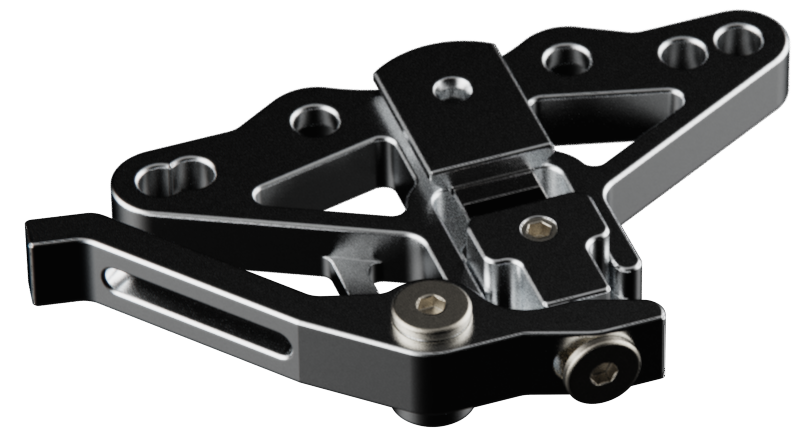
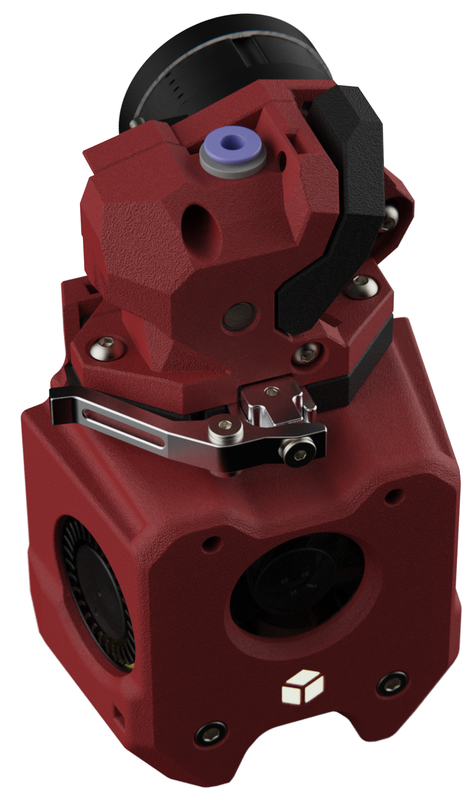

[![CC BY-NC-SA 4.0][cc-by-nc-sa-shield]][cc-by-nc-sa]

# A4T Cutter
A CNC filament cutter from:  [DW-Tas](https://github.com/DW-Tas)

  
Building on the work of Treintjes <a href="https://github.com/Treintjes/Magneto_Filament_Cutter">Magneto_Filament_Cutter</a>  
This is an early attempt at making it more universal for use in printed toolheads. Starting of course with <a href="https://github.com/Armchair-Heavy-Industries/A4T">A4T</a>.
   

> [!WARNING]
> ### Not even tested  
> Nothing on this repo has even been tested yet. 

  

> [!TIP] 
> ### You can help support the development of this project. 
> Donate at https://ko-fi.com/dwtas 

  

#### This work is licensed under a
[Creative Commons Attribution-NonCommercial-ShareAlike 4.0 International License][cc-by-nc-sa].

[![CC BY-NC-SA 4.0][cc-by-nc-sa-image]][cc-by-nc-sa]

[cc-by-nc-sa]: http://creativecommons.org/licenses/by-nc-sa/4.0/
[cc-by-nc-sa-image]: https://licensebuttons.net/l/by-nc-sa/4.0/88x31.png
[cc-by-nc-sa-shield]: https://img.shields.io/badge/License-CC%20BY--NC--SA%204.0-lightgrey.svg

### License clarification regarding non-commercial use:
The non-commercial aspect of this license is for cases where A4T Cutter is the product, not the use of A4T Cutter to create products. 
I.e. If you wish to sell A4T Cutter as a product, you would need to seek a commercial license before doing so.  
It is NOT intended to prevent the use of A4T Cutter in a printer that you use to provide commercial services. If you want to run A4T Cutter as a toolhead for your print farm printers, go right ahead.
